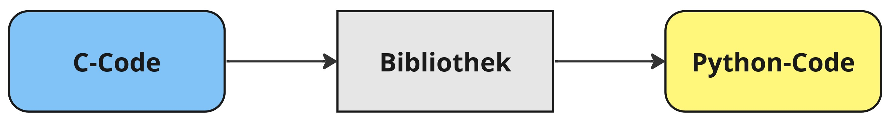

# Integration von C Code in Python
## Advanced Python
### Philipp Gerloff
#### 16.05.2024

---
## Einleitung

### Gliederung
- Wie unterscheiden sich Python und C
- Warum sollte man C-Code in Python ausführen wollen?
- Wie unterscheiden sich die Performance von Python und C?
- Vorstellung der 3 gängigsten Methoden zur Implementierung von C-Code in Python
- Vergleich der Laufzeit und der Komplexizität

## Warum sollte ich C-Code in Python ausführen?

### Unterschiede zwischen C und Python:
| Eigenschaft         | Python            | C           |
|---------------------|-------------------|-------------|
| Ausführung          | Interpretiert     | Kompiliert  |
| Datentypen          | Dynamische Typen  | Statische Typen |
| Syntax              | Einfach           | Komplexer   |
| Speichermanagement  | Automatisch       | Manuell     |
| Performance         | Langsamer         | Schneller   |

Integration von C in Python ermöglicht Vorteile beider Sprachen, z.B. Ausgleich der langsamen Laufzeit von Python.

## Wie kommunizieren Python und C

- Die gängigsten Arten, über die C-Code in Python integriert wird, sind Cython, Ctypes und Pythons C API. Diese drei Varianten werden auf unterschiedliche Art und Weise umgesetzt und bieten jeweils gewisse Vor- und Nachteile.
- Die Umsetzung ist jeweils ähnlich und wird über die Erstellung von Modulen gemacht.
- Einige Beispiele, in denen C-Code in Python genutzt wird, um die Vorteile von C zu nutzen, sind zum Beispiel **numpy**, **pytorch** und **pandas**

    

## Performancevergleich - 1

- Um die Unterschiede zwischen den beiden Programmiersprachen darzustellen, wird ein Programm genutzt, dass eine Textdatei mit 1.000.000 Zahlen ausliest, jede Zahl quadriert, und die Summe der quadrierten Zahlen bildet.
- Dieses Programm wird zuerst jeweils in reinem Python und C geschrieben.
- Die Komplexität der Syntax wird untersucht und die Laufzeit gemessen.

## Performancevergleich - 2

```python
def calculate_sum_of_squares():

    file_path = "../numbers.txt"
    with open(file_path, "r") as f:
        total = sum(int(row.strip()) ** 2 for row in f)
        
    print(total)
```

```python
#include <stdio.h>
#include <stdlib.h>

int main() {
    FILE *file = fopen("../numbers.txt", "r");
    if (file == NULL) {
        perror("Error opening file");
        return 1;
    }

    long int total = 0;
    int num;

    while (fscanf(file, "%d", &num) == 1) {
        total += num * num;
    }
    fclose(file);

    printf("%ld\n", total);

    return 0;
}
```

## Methode 1: ctypes

Um C-Code über ctypes zu nutzen wird der C-Code ohne Änderungen als .c Datei übernommen. Aus diesem Code wird eine Bibliothek erstellt. Der Vorgang ist dabei derselbe wie bei dem Erstellen einer regulären C-Bibliothek.

In Python wird diese Bibliothek mittels der ctypes-Bibliothek importiert. Hierbei muss nur noch darauf geachtet werden, dass die Datentypen der übergebenen Parameter und der Rückgabewerte definiert werden müssen.

```python
import ctypes

lib = ctypes.CDLL('./sum_of_squares.so')

lib.calculate_sum_of_squares.argtypes = [ctypes.c_char_p]
lib.calculate_sum_of_squares.restype = ctypes.c_long

total = lib.calculate_sum_of_squares(b"../numbers.txt")
print(total)
```

## Methode 2: Cython - 1

Für Cython werden nicht mehr die vorherigen c-Dateien genutzt, sondern es wird eine .pyx Datei erstellt. Diese datei enthält syntaktisch eine Mischung aus C und Pyhon code. In ihr werden die benötigten Datentypen definiert und beschrieben, in welchen C Modulen sie zu finden sind.
```python
cdef extern from "stdio.h":
    ctypedef struct FILE
    FILE *fopen(const char *filename, const char *mode)
    int fclose(FILE *stream)
    int fscanf(FILE *stream, const char *format, ...)

def calculate_sum_of_squares():
    cdef FILE *file = fopen("../numbers.txt", "r")
    cdef long total = 0
    cdef int num

    while fscanf(file, "%d", &num) == 1:
        total += num * num

    fclose(file)

    print(total)
```

## Methode 2: Cython - 2

Die .pyx Datei muss nun mittles der setuptools von Python in ein Python modul konvertiert werden. Das geschieht über eine setup.py Datei Cython erstellt dabei eine neue, sehr umfangreiche .c Datei. Diese Datei wird dann wie bei ctypes in eine Python bibliothek konvertiert:
```python
from setuptools import setup
from Cython.Build import cythonize

setup(
    name='sum_of_squares',
    ext_modules=cythonize("sum_of_squares.pyx"),
)
```

Danach kann die neue Bibliothek in Python importiert werden.

## Python's C API - 1

Im C-Code für die Nutzung der C-API wird die ursprüngliche C-Funktion übernommen. Darüber hinaus werden diverse Python-Objekte erzeugt. Dafür wird die `python.h` Bibliothek inkludiert.

Der so geschriebene C-Code wird dann mittels einer `setup.py` Datei in ein Modul umgewandelt, dass dann in Python importiert werden kann.

```python
from distutils.core import setup, Extension

module = Extension('sum_of_squares_c_api', sources=['sum_of_squares_c_api.c'])

setup(name='sum_of_squares_c_api',
      ext_modules=[module])
```

## Python's C API - 2
Die erzeugten Python Objekte sind:

- **PyObject:** Erstellt ein Python Objekt aus der C-Funktion
- **PyMethodDef:** Containerobjekt, das alle einzelnen Funktionen beinhaltet. Für jede Funktion werden Informationen wie der Name der Funktion und ein Pointer zum PyObject hinterlegt.
- **PyModuleDef:** Objekt, das das Modul definiert, inklusive des Namens des Moduls und der beinhalteten Funktionen.


## Python's C API - 3
```c
#include <Python.h>

// long int calculate_sum_of_squares(const char *filename) {...} 

static PyObject* py_calculate_sum_of_squares(PyObject* self, PyObject* args) {
    const char* filename;

    if (!PyArg_ParseTuple(args, "s", &filename)) {
        return NULL;
    }

    long int result = calculate_sum_of_squares(filename);

    return PyLong_FromLong(result);
}

static PyMethodDef module_methods[] = {
    {"calculate_sum_of_squares", py_calculate_sum_of_squares, METH_VARARGS, "Calculate the sum of squares from a file."}
};

static struct PyModuleDef sum_of_squares_module = {
    PyModuleDef_HEAD_INIT,
    "sum_of_squares_c_api",
    NULL,
    -1,
    module_methods
};

PyMODINIT_FUNC PyInit_sum_of_squares_c_api(void) {
    return PyModule_Create(&sum_of_squares_module);
}
```

## Laufzeit und Komplexizität

Zum Vergleich der Laufzeiten wurde unter Linux das Kommando `time` benutzt.

| Umsetzung                           | Laufzeit                                  | Syntax                                      |
|-------------------------------------|-------------------------------------------|---------------------------------------------|
| Python                              | 0,429s                                    | Einfach                                     |
| C                                   | 0,088s                                    | Mittel                                      |
|-------------------------------------|-------------------------------------------|---------------------------------------------|
| ctypes                              | 0,141s                                    | <span style="color:green">Einfach</span>    |
| Cython                              | <span style="color:green">0,111s</span>   | Mittel                                      |
| C-API                               | 0,115s                                    | Komplex                                     |

Cython ist demnach die Methode, die am meisten Performancegewinne bietet.


## Zusammenfassung

Dieses (einfache) Beispiel zeigt, dass **cython** die **beste Performance** bietet und dabei immer noch relativ **einfach umzusetzen** ist.

Ctypes bieten den geringsten Performancegewinn, dafür ist die Syntax sehr einfach.

Die C-API ist nur geringfügig langsamer als Cython, aber dafür deutlich komplexer in der Syntax.

Die beste Methode für die Integration von C-Code in Python hängt letzten Endes von den Anforderungen an die Anwendung ab.
